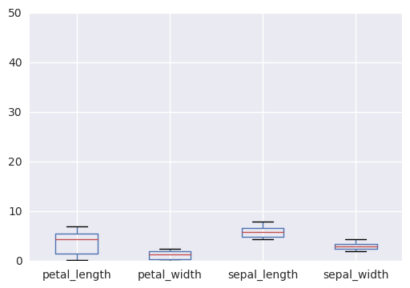
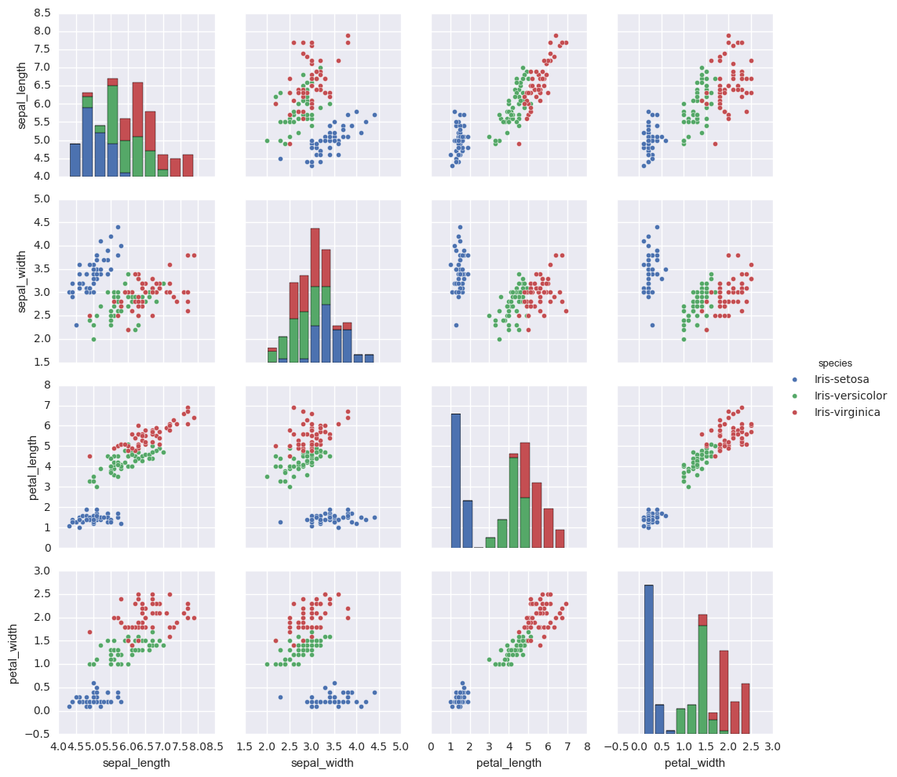

MSDS 6306_Live Session Homework 13--Angela Horacek


### 1. CREATE A LIST NAMED my_list IN PYTHON WITH THE FOLLOWING DATA POINTS:


```python
my_list = [45.4, 44.2, 36.8, 35.1, 39.0, 60.0, 47.4, 41.1, 45.8, 35.6]
```

1.a.  Print the 5th element in the list.


```python
my_list[4]

```


    39.0


1.b. Append 55.2 to my_list


```python
var1 = 55.2
my_list.append(var1)
print (my_list)

```

    [45.4, 44.2, 36.8, 35.1, 39.0, 60.0, 47.4, 41.1, 45.8, 35.6, 55.2]
    

1.c. Remove the 6th element in the list.


```python
del my_list [5]
print (my_list)
```

    [45.4, 44.2, 36.8, 35.1, 39.0, 47.4, 41.1, 45.8, 35.6, 55.2]
    

1.d Iterate over the list to print data points greater than 45.


```python

for val in my_list:
    if val > 45:
        print (val)
            
```

    45.4
    47.4
    45.8
    55.2
    

### 2. INTRODUCTION TO NUMPY 

2.a. Import the numpy library using the following command import numpy.


```python
import numpy
```

2.b. Declare numpy array with the same data points as in my_list using numpy.array()


```python
array1 = numpy.array([45.4, 44.2, 36.8, 35.1, 39.0, 60.0, 47.4, 41.1, 45.8, 35.6])
print (array1)

```

    [ 45.4  44.2  36.8  35.1  39.   60.   47.4  41.1  45.8  35.6]
    

2.c. Compute the mean and standard deviation using numpy.mean() and numpy.std() of the above array.


```python
mean1 = numpy.mean(array1)
print ("Mean is", mean1)
sd1 = numpy.std(array1)
print ("Standard deviation is", sd1)
```

    Mean is 43.04
    Standard deviation is 7.06118970146
    

2.d. Use logical referencing to get only those values that are less than 45.


```python
array1[numpy.where(array1<45)]

```


    array([ 44.2,  36.8,  35.1,  39. ,  41.1,  35.6])


2.e. Compute the max and min or the array using numpy.max() and numpy.min().


```python
max1 = numpy.max(array1)
print ("Max is", max1)
min1 = numpy.min(array1)
print ("Min is", min1)
```

    Max is 60.0
    Min is 35.1
    

### 3. INTRODUCTION TO PANDAS

3.a. Import the pandas library-import pandas.


```python
import pandas
```

3.b. Read the IRIS dataset into iris using pandas.read_csv(). Data file-


```python
iris = pandas.read_csv("C:/Users/Angela/Anaconda3/Lib/site-packages/blaze/examples/data/iris.csv")
```

3.c. Using iris.head(), display the head of the dataset.
Note:  I had to add an "id" column into the original file to show that I 
could drop the id column in 3.d.  


```python
iris.head()
```


<div>
<table border="1" class="dataframe">
  <thead>
    <tr style="text-align: right;">
      <th></th>
      <th>id</th>
      <th>sepal_length</th>
      <th>sepal_width</th>
      <th>petal_length</th>
      <th>petal_width</th>
      <th>species</th>
    </tr>
  </thead>
  <tbody>
    <tr>
      <th>0</th>
      <td>1</td>
      <td>5.1</td>
      <td>3.5</td>
      <td>1.4</td>
      <td>0.2</td>
      <td>Iris-setosa</td>
    </tr>
    <tr>
      <th>1</th>
      <td>2</td>
      <td>4.9</td>
      <td>3.0</td>
      <td>1.4</td>
      <td>0.2</td>
      <td>Iris-setosa</td>
    </tr>
    <tr>
      <th>2</th>
      <td>3</td>
      <td>4.7</td>
      <td>3.2</td>
      <td>1.3</td>
      <td>0.2</td>
      <td>Iris-setosa</td>
    </tr>
    <tr>
      <th>3</th>
      <td>4</td>
      <td>4.6</td>
      <td>3.1</td>
      <td>1.5</td>
      <td>0.2</td>
      <td>Iris-setosa</td>
    </tr>
    <tr>
      <th>4</th>
      <td>5</td>
      <td>5.0</td>
      <td>3.6</td>
      <td>1.4</td>
      <td>0.2</td>
      <td>Iris-setosa</td>
    </tr>
  </tbody>
</table>
</div>


3.d. Use DataFrame.drop() to drop the id column.


```python
iris1=iris.drop(iris.columns[[0]], axis=1)
iris1
```


<div>
<table border="1" class="dataframe">
  <thead>
    <tr style="text-align: right;">
      <th></th>
      <th>sepal_length</th>
      <th>sepal_width</th>
      <th>petal_length</th>
      <th>petal_width</th>
      <th>species</th>
    </tr>
  </thead>
  <tbody>
    <tr>
      <th>0</th>
      <td>5.1</td>
      <td>3.5</td>
      <td>1.4</td>
      <td>0.2</td>
      <td>Iris-setosa</td>
    </tr>
    <tr>
      <th>1</th>
      <td>4.9</td>
      <td>3.0</td>
      <td>1.4</td>
      <td>0.2</td>
      <td>Iris-setosa</td>
    </tr>
    <tr>
      <th>2</th>
      <td>4.7</td>
      <td>3.2</td>
      <td>1.3</td>
      <td>0.2</td>
      <td>Iris-setosa</td>
    </tr>
    <tr>
      <th>3</th>
      <td>4.6</td>
      <td>3.1</td>
      <td>1.5</td>
      <td>0.2</td>
      <td>Iris-setosa</td>
    </tr>
    <tr>
      <th>4</th>
      <td>5.0</td>
      <td>3.6</td>
      <td>1.4</td>
      <td>0.2</td>
      <td>Iris-setosa</td>
    </tr>
    <tr>
      <th>5</th>
      <td>5.4</td>
      <td>3.9</td>
      <td>1.7</td>
      <td>0.4</td>
      <td>Iris-setosa</td>
    </tr>
    <tr>
      <th>6</th>
      <td>4.6</td>
      <td>3.4</td>
      <td>1.4</td>
      <td>0.3</td>
      <td>Iris-setosa</td>
    </tr>
    <tr>
      <th>7</th>
      <td>5.0</td>
      <td>3.4</td>
      <td>1.5</td>
      <td>0.2</td>
      <td>Iris-setosa</td>
    </tr>
    <tr>
      <th>8</th>
      <td>4.4</td>
      <td>2.9</td>
      <td>1.4</td>
      <td>0.2</td>
      <td>Iris-setosa</td>
    </tr>
    <tr>
      <th>9</th>
      <td>4.9</td>
      <td>3.1</td>
      <td>1.5</td>
      <td>0.1</td>
      <td>Iris-setosa</td>
    </tr>
    <tr>
      <th>10</th>
      <td>5.4</td>
      <td>3.7</td>
      <td>1.5</td>
      <td>0.2</td>
      <td>Iris-setosa</td>
    </tr>
    <tr>
      <th>11</th>
      <td>4.8</td>
      <td>3.4</td>
      <td>1.6</td>
      <td>0.2</td>
      <td>Iris-setosa</td>
    </tr>
    <tr>
      <th>12</th>
      <td>4.8</td>
      <td>3.0</td>
      <td>1.4</td>
      <td>0.1</td>
      <td>Iris-setosa</td>
    </tr>
    <tr>
      <th>13</th>
      <td>4.3</td>
      <td>3.0</td>
      <td>1.1</td>
      <td>0.1</td>
      <td>Iris-setosa</td>
    </tr>
    <tr>
      <th>14</th>
      <td>5.8</td>
      <td>4.0</td>
      <td>1.2</td>
      <td>0.2</td>
      <td>Iris-setosa</td>
    </tr>
    <tr>
      <th>15</th>
      <td>5.7</td>
      <td>4.4</td>
      <td>1.5</td>
      <td>0.4</td>
      <td>Iris-setosa</td>
    </tr>
    <tr>
      <th>16</th>
      <td>5.4</td>
      <td>3.9</td>
      <td>1.3</td>
      <td>0.4</td>
      <td>Iris-setosa</td>
    </tr>
    <tr>
      <th>17</th>
      <td>5.1</td>
      <td>3.5</td>
      <td>1.4</td>
      <td>0.3</td>
      <td>Iris-setosa</td>
    </tr>
    <tr>
      <th>18</th>
      <td>5.7</td>
      <td>3.8</td>
      <td>1.7</td>
      <td>0.3</td>
      <td>Iris-setosa</td>
    </tr>
    <tr>
      <th>19</th>
      <td>5.1</td>
      <td>3.8</td>
      <td>1.5</td>
      <td>0.3</td>
      <td>Iris-setosa</td>
    </tr>
    <tr>
      <th>20</th>
      <td>5.4</td>
      <td>3.4</td>
      <td>1.7</td>
      <td>0.2</td>
      <td>Iris-setosa</td>
    </tr>
    <tr>
      <th>21</th>
      <td>5.1</td>
      <td>3.7</td>
      <td>1.5</td>
      <td>0.4</td>
      <td>Iris-setosa</td>
    </tr>
    <tr>
      <th>22</th>
      <td>4.6</td>
      <td>3.6</td>
      <td>1.0</td>
      <td>0.2</td>
      <td>Iris-setosa</td>
    </tr>
    <tr>
      <th>23</th>
      <td>5.1</td>
      <td>3.3</td>
      <td>1.7</td>
      <td>0.5</td>
      <td>Iris-setosa</td>
    </tr>
    <tr>
      <th>24</th>
      <td>4.8</td>
      <td>3.4</td>
      <td>1.9</td>
      <td>0.2</td>
      <td>Iris-setosa</td>
    </tr>
    <tr>
      <th>25</th>
      <td>5.0</td>
      <td>3.0</td>
      <td>1.6</td>
      <td>0.2</td>
      <td>Iris-setosa</td>
    </tr>
    <tr>
      <th>26</th>
      <td>5.0</td>
      <td>3.4</td>
      <td>1.6</td>
      <td>0.4</td>
      <td>Iris-setosa</td>
    </tr>
    <tr>
      <th>27</th>
      <td>5.2</td>
      <td>3.5</td>
      <td>1.5</td>
      <td>0.2</td>
      <td>Iris-setosa</td>
    </tr>
    <tr>
      <th>28</th>
      <td>5.2</td>
      <td>3.4</td>
      <td>1.4</td>
      <td>0.2</td>
      <td>Iris-setosa</td>
    </tr>
    <tr>
      <th>29</th>
      <td>4.7</td>
      <td>3.2</td>
      <td>1.6</td>
      <td>0.2</td>
      <td>Iris-setosa</td>
    </tr>
    <tr>
      <th>...</th>
      <td>...</td>
      <td>...</td>
      <td>...</td>
      <td>...</td>
      <td>...</td>
    </tr>
    <tr>
      <th>120</th>
      <td>6.9</td>
      <td>3.2</td>
      <td>5.7</td>
      <td>2.3</td>
      <td>Iris-virginica</td>
    </tr>
    <tr>
      <th>121</th>
      <td>5.6</td>
      <td>2.8</td>
      <td>4.9</td>
      <td>2.0</td>
      <td>Iris-virginica</td>
    </tr>
    <tr>
      <th>122</th>
      <td>7.7</td>
      <td>2.8</td>
      <td>6.7</td>
      <td>2.0</td>
      <td>Iris-virginica</td>
    </tr>
    <tr>
      <th>123</th>
      <td>6.3</td>
      <td>2.7</td>
      <td>4.9</td>
      <td>1.8</td>
      <td>Iris-virginica</td>
    </tr>
    <tr>
      <th>124</th>
      <td>6.7</td>
      <td>3.3</td>
      <td>5.7</td>
      <td>2.1</td>
      <td>Iris-virginica</td>
    </tr>
    <tr>
      <th>125</th>
      <td>7.2</td>
      <td>3.2</td>
      <td>6.0</td>
      <td>1.8</td>
      <td>Iris-virginica</td>
    </tr>
    <tr>
      <th>126</th>
      <td>6.2</td>
      <td>2.8</td>
      <td>4.8</td>
      <td>1.8</td>
      <td>Iris-virginica</td>
    </tr>
    <tr>
      <th>127</th>
      <td>6.1</td>
      <td>3.0</td>
      <td>4.9</td>
      <td>1.8</td>
      <td>Iris-virginica</td>
    </tr>
    <tr>
      <th>128</th>
      <td>6.4</td>
      <td>2.8</td>
      <td>5.6</td>
      <td>2.1</td>
      <td>Iris-virginica</td>
    </tr>
    <tr>
      <th>129</th>
      <td>7.2</td>
      <td>3.0</td>
      <td>5.8</td>
      <td>1.6</td>
      <td>Iris-virginica</td>
    </tr>
    <tr>
      <th>130</th>
      <td>7.4</td>
      <td>2.8</td>
      <td>6.1</td>
      <td>1.9</td>
      <td>Iris-virginica</td>
    </tr>
    <tr>
      <th>131</th>
      <td>7.9</td>
      <td>3.8</td>
      <td>6.4</td>
      <td>2.0</td>
      <td>Iris-virginica</td>
    </tr>
    <tr>
      <th>132</th>
      <td>6.4</td>
      <td>2.8</td>
      <td>5.6</td>
      <td>2.2</td>
      <td>Iris-virginica</td>
    </tr>
    <tr>
      <th>133</th>
      <td>6.3</td>
      <td>2.8</td>
      <td>5.1</td>
      <td>1.5</td>
      <td>Iris-virginica</td>
    </tr>
    <tr>
      <th>134</th>
      <td>6.1</td>
      <td>2.6</td>
      <td>5.6</td>
      <td>1.4</td>
      <td>Iris-virginica</td>
    </tr>
    <tr>
      <th>135</th>
      <td>7.7</td>
      <td>3.0</td>
      <td>6.1</td>
      <td>2.3</td>
      <td>Iris-virginica</td>
    </tr>
    <tr>
      <th>136</th>
      <td>6.3</td>
      <td>3.4</td>
      <td>5.6</td>
      <td>2.4</td>
      <td>Iris-virginica</td>
    </tr>
    <tr>
      <th>137</th>
      <td>6.4</td>
      <td>3.1</td>
      <td>5.5</td>
      <td>1.8</td>
      <td>Iris-virginica</td>
    </tr>
    <tr>
      <th>138</th>
      <td>6.0</td>
      <td>3.0</td>
      <td>4.8</td>
      <td>1.8</td>
      <td>Iris-virginica</td>
    </tr>
    <tr>
      <th>139</th>
      <td>6.9</td>
      <td>3.1</td>
      <td>5.4</td>
      <td>2.1</td>
      <td>Iris-virginica</td>
    </tr>
    <tr>
      <th>140</th>
      <td>6.7</td>
      <td>3.1</td>
      <td>5.6</td>
      <td>2.4</td>
      <td>Iris-virginica</td>
    </tr>
    <tr>
      <th>141</th>
      <td>6.9</td>
      <td>3.1</td>
      <td>5.1</td>
      <td>2.3</td>
      <td>Iris-virginica</td>
    </tr>
    <tr>
      <th>142</th>
      <td>5.8</td>
      <td>2.7</td>
      <td>5.1</td>
      <td>1.9</td>
      <td>Iris-virginica</td>
    </tr>
    <tr>
      <th>143</th>
      <td>6.8</td>
      <td>3.2</td>
      <td>5.9</td>
      <td>2.3</td>
      <td>Iris-virginica</td>
    </tr>
    <tr>
      <th>144</th>
      <td>6.7</td>
      <td>3.3</td>
      <td>5.7</td>
      <td>2.5</td>
      <td>Iris-virginica</td>
    </tr>
    <tr>
      <th>145</th>
      <td>6.7</td>
      <td>3.0</td>
      <td>5.2</td>
      <td>2.3</td>
      <td>Iris-virginica</td>
    </tr>
    <tr>
      <th>146</th>
      <td>6.3</td>
      <td>2.5</td>
      <td>5.0</td>
      <td>1.9</td>
      <td>Iris-virginica</td>
    </tr>
    <tr>
      <th>147</th>
      <td>6.5</td>
      <td>3.0</td>
      <td>5.2</td>
      <td>2.0</td>
      <td>Iris-virginica</td>
    </tr>
    <tr>
      <th>148</th>
      <td>6.2</td>
      <td>3.4</td>
      <td>5.4</td>
      <td>2.3</td>
      <td>Iris-virginica</td>
    </tr>
    <tr>
      <th>149</th>
      <td>5.9</td>
      <td>3.0</td>
      <td>5.1</td>
      <td>1.8</td>
      <td>Iris-virginica</td>
    </tr>
  </tbody>
</table>
<p>150 rows × 5 columns</p>
</div>


3.e. Subset dataframe to create a new data frame that includes only the measurements for the setosa species.


```python
setosa_df = iris1[iris1.species == "Iris-setosa"]
setosa_df
```


<div>
<table border="1" class="dataframe">
  <thead>
    <tr style="text-align: right;">
      <th></th>
      <th>sepal_length</th>
      <th>sepal_width</th>
      <th>petal_length</th>
      <th>petal_width</th>
      <th>species</th>
    </tr>
  </thead>
  <tbody>
    <tr>
      <th>0</th>
      <td>5.1</td>
      <td>3.5</td>
      <td>1.4</td>
      <td>0.2</td>
      <td>Iris-setosa</td>
    </tr>
    <tr>
      <th>1</th>
      <td>4.9</td>
      <td>3.0</td>
      <td>1.4</td>
      <td>0.2</td>
      <td>Iris-setosa</td>
    </tr>
    <tr>
      <th>2</th>
      <td>4.7</td>
      <td>3.2</td>
      <td>1.3</td>
      <td>0.2</td>
      <td>Iris-setosa</td>
    </tr>
    <tr>
      <th>3</th>
      <td>4.6</td>
      <td>3.1</td>
      <td>1.5</td>
      <td>0.2</td>
      <td>Iris-setosa</td>
    </tr>
    <tr>
      <th>4</th>
      <td>5.0</td>
      <td>3.6</td>
      <td>1.4</td>
      <td>0.2</td>
      <td>Iris-setosa</td>
    </tr>
    <tr>
      <th>5</th>
      <td>5.4</td>
      <td>3.9</td>
      <td>1.7</td>
      <td>0.4</td>
      <td>Iris-setosa</td>
    </tr>
    <tr>
      <th>6</th>
      <td>4.6</td>
      <td>3.4</td>
      <td>1.4</td>
      <td>0.3</td>
      <td>Iris-setosa</td>
    </tr>
    <tr>
      <th>7</th>
      <td>5.0</td>
      <td>3.4</td>
      <td>1.5</td>
      <td>0.2</td>
      <td>Iris-setosa</td>
    </tr>
    <tr>
      <th>8</th>
      <td>4.4</td>
      <td>2.9</td>
      <td>1.4</td>
      <td>0.2</td>
      <td>Iris-setosa</td>
    </tr>
    <tr>
      <th>9</th>
      <td>4.9</td>
      <td>3.1</td>
      <td>1.5</td>
      <td>0.1</td>
      <td>Iris-setosa</td>
    </tr>
    <tr>
      <th>10</th>
      <td>5.4</td>
      <td>3.7</td>
      <td>1.5</td>
      <td>0.2</td>
      <td>Iris-setosa</td>
    </tr>
    <tr>
      <th>11</th>
      <td>4.8</td>
      <td>3.4</td>
      <td>1.6</td>
      <td>0.2</td>
      <td>Iris-setosa</td>
    </tr>
    <tr>
      <th>12</th>
      <td>4.8</td>
      <td>3.0</td>
      <td>1.4</td>
      <td>0.1</td>
      <td>Iris-setosa</td>
    </tr>
    <tr>
      <th>13</th>
      <td>4.3</td>
      <td>3.0</td>
      <td>1.1</td>
      <td>0.1</td>
      <td>Iris-setosa</td>
    </tr>
    <tr>
      <th>14</th>
      <td>5.8</td>
      <td>4.0</td>
      <td>1.2</td>
      <td>0.2</td>
      <td>Iris-setosa</td>
    </tr>
    <tr>
      <th>15</th>
      <td>5.7</td>
      <td>4.4</td>
      <td>1.5</td>
      <td>0.4</td>
      <td>Iris-setosa</td>
    </tr>
    <tr>
      <th>16</th>
      <td>5.4</td>
      <td>3.9</td>
      <td>1.3</td>
      <td>0.4</td>
      <td>Iris-setosa</td>
    </tr>
    <tr>
      <th>17</th>
      <td>5.1</td>
      <td>3.5</td>
      <td>1.4</td>
      <td>0.3</td>
      <td>Iris-setosa</td>
    </tr>
    <tr>
      <th>18</th>
      <td>5.7</td>
      <td>3.8</td>
      <td>1.7</td>
      <td>0.3</td>
      <td>Iris-setosa</td>
    </tr>
    <tr>
      <th>19</th>
      <td>5.1</td>
      <td>3.8</td>
      <td>1.5</td>
      <td>0.3</td>
      <td>Iris-setosa</td>
    </tr>
    <tr>
      <th>20</th>
      <td>5.4</td>
      <td>3.4</td>
      <td>1.7</td>
      <td>0.2</td>
      <td>Iris-setosa</td>
    </tr>
    <tr>
      <th>21</th>
      <td>5.1</td>
      <td>3.7</td>
      <td>1.5</td>
      <td>0.4</td>
      <td>Iris-setosa</td>
    </tr>
    <tr>
      <th>22</th>
      <td>4.6</td>
      <td>3.6</td>
      <td>1.0</td>
      <td>0.2</td>
      <td>Iris-setosa</td>
    </tr>
    <tr>
      <th>23</th>
      <td>5.1</td>
      <td>3.3</td>
      <td>1.7</td>
      <td>0.5</td>
      <td>Iris-setosa</td>
    </tr>
    <tr>
      <th>24</th>
      <td>4.8</td>
      <td>3.4</td>
      <td>1.9</td>
      <td>0.2</td>
      <td>Iris-setosa</td>
    </tr>
    <tr>
      <th>25</th>
      <td>5.0</td>
      <td>3.0</td>
      <td>1.6</td>
      <td>0.2</td>
      <td>Iris-setosa</td>
    </tr>
    <tr>
      <th>26</th>
      <td>5.0</td>
      <td>3.4</td>
      <td>1.6</td>
      <td>0.4</td>
      <td>Iris-setosa</td>
    </tr>
    <tr>
      <th>27</th>
      <td>5.2</td>
      <td>3.5</td>
      <td>1.5</td>
      <td>0.2</td>
      <td>Iris-setosa</td>
    </tr>
    <tr>
      <th>28</th>
      <td>5.2</td>
      <td>3.4</td>
      <td>1.4</td>
      <td>0.2</td>
      <td>Iris-setosa</td>
    </tr>
    <tr>
      <th>29</th>
      <td>4.7</td>
      <td>3.2</td>
      <td>1.6</td>
      <td>0.2</td>
      <td>Iris-setosa</td>
    </tr>
    <tr>
      <th>30</th>
      <td>4.8</td>
      <td>3.1</td>
      <td>1.6</td>
      <td>0.2</td>
      <td>Iris-setosa</td>
    </tr>
    <tr>
      <th>31</th>
      <td>5.4</td>
      <td>3.4</td>
      <td>1.5</td>
      <td>0.4</td>
      <td>Iris-setosa</td>
    </tr>
    <tr>
      <th>32</th>
      <td>5.2</td>
      <td>4.1</td>
      <td>1.5</td>
      <td>0.1</td>
      <td>Iris-setosa</td>
    </tr>
    <tr>
      <th>33</th>
      <td>5.5</td>
      <td>4.2</td>
      <td>1.4</td>
      <td>0.2</td>
      <td>Iris-setosa</td>
    </tr>
    <tr>
      <th>34</th>
      <td>4.9</td>
      <td>3.1</td>
      <td>1.5</td>
      <td>0.2</td>
      <td>Iris-setosa</td>
    </tr>
    <tr>
      <th>35</th>
      <td>5.0</td>
      <td>3.2</td>
      <td>1.2</td>
      <td>0.2</td>
      <td>Iris-setosa</td>
    </tr>
    <tr>
      <th>36</th>
      <td>5.5</td>
      <td>3.5</td>
      <td>1.3</td>
      <td>0.2</td>
      <td>Iris-setosa</td>
    </tr>
    <tr>
      <th>37</th>
      <td>4.9</td>
      <td>3.6</td>
      <td>1.4</td>
      <td>0.1</td>
      <td>Iris-setosa</td>
    </tr>
    <tr>
      <th>38</th>
      <td>4.4</td>
      <td>3.0</td>
      <td>1.3</td>
      <td>0.2</td>
      <td>Iris-setosa</td>
    </tr>
    <tr>
      <th>39</th>
      <td>5.1</td>
      <td>3.4</td>
      <td>1.5</td>
      <td>0.2</td>
      <td>Iris-setosa</td>
    </tr>
    <tr>
      <th>40</th>
      <td>5.0</td>
      <td>3.5</td>
      <td>1.3</td>
      <td>0.3</td>
      <td>Iris-setosa</td>
    </tr>
    <tr>
      <th>41</th>
      <td>4.5</td>
      <td>2.3</td>
      <td>1.3</td>
      <td>0.3</td>
      <td>Iris-setosa</td>
    </tr>
    <tr>
      <th>42</th>
      <td>4.4</td>
      <td>3.2</td>
      <td>1.3</td>
      <td>0.2</td>
      <td>Iris-setosa</td>
    </tr>
    <tr>
      <th>43</th>
      <td>5.0</td>
      <td>3.5</td>
      <td>1.6</td>
      <td>0.6</td>
      <td>Iris-setosa</td>
    </tr>
    <tr>
      <th>44</th>
      <td>5.1</td>
      <td>3.8</td>
      <td>1.9</td>
      <td>0.4</td>
      <td>Iris-setosa</td>
    </tr>
    <tr>
      <th>45</th>
      <td>4.8</td>
      <td>3.0</td>
      <td>1.4</td>
      <td>0.3</td>
      <td>Iris-setosa</td>
    </tr>
    <tr>
      <th>46</th>
      <td>5.1</td>
      <td>3.8</td>
      <td>1.6</td>
      <td>0.2</td>
      <td>Iris-setosa</td>
    </tr>
    <tr>
      <th>47</th>
      <td>4.6</td>
      <td>3.2</td>
      <td>1.4</td>
      <td>0.2</td>
      <td>Iris-setosa</td>
    </tr>
    <tr>
      <th>48</th>
      <td>5.3</td>
      <td>3.7</td>
      <td>1.5</td>
      <td>0.2</td>
      <td>Iris-setosa</td>
    </tr>
    <tr>
      <th>49</th>
      <td>5.0</td>
      <td>3.3</td>
      <td>1.4</td>
      <td>0.2</td>
      <td>Iris-setosa</td>
    </tr>
  </tbody>
</table>
</div>


3.f. Use DataFrame.describe() to get the summary statistics.


```python
iris1.describe()
```


<div>
<table border="1" class="dataframe">
  <thead>
    <tr style="text-align: right;">
      <th></th>
      <th>sepal_length</th>
      <th>sepal_width</th>
      <th>petal_length</th>
      <th>petal_width</th>
    </tr>
  </thead>
  <tbody>
    <tr>
      <th>count</th>
      <td>150.000000</td>
      <td>150.000000</td>
      <td>150.000000</td>
      <td>150.000000</td>
    </tr>
    <tr>
      <th>mean</th>
      <td>5.843333</td>
      <td>3.057333</td>
      <td>3.758000</td>
      <td>1.199333</td>
    </tr>
    <tr>
      <th>std</th>
      <td>0.828066</td>
      <td>0.435866</td>
      <td>1.765298</td>
      <td>0.762238</td>
    </tr>
    <tr>
      <th>min</th>
      <td>4.300000</td>
      <td>2.000000</td>
      <td>1.000000</td>
      <td>0.100000</td>
    </tr>
    <tr>
      <th>25%</th>
      <td>5.100000</td>
      <td>2.800000</td>
      <td>1.600000</td>
      <td>0.300000</td>
    </tr>
    <tr>
      <th>50%</th>
      <td>5.800000</td>
      <td>3.000000</td>
      <td>4.350000</td>
      <td>1.300000</td>
    </tr>
    <tr>
      <th>75%</th>
      <td>6.400000</td>
      <td>3.300000</td>
      <td>5.100000</td>
      <td>1.800000</td>
    </tr>
    <tr>
      <th>max</th>
      <td>7.900000</td>
      <td>4.400000</td>
      <td>6.900000</td>
      <td>2.500000</td>
    </tr>
  </tbody>
</table>
</div>


4.g. Use DataFrame.grouby() to create grouped data frames by Species 
and compute summary statistics using DataFrame.describe()


```python
species_group = iris1.groupby(['species']).describe()
species_group

```


<div>
<table border="1" class="dataframe">
  <thead>
    <tr style="text-align: right;">
      <th></th>
      <th></th>
      <th>petal_length</th>
      <th>petal_width</th>
      <th>sepal_length</th>
      <th>sepal_width</th>
    </tr>
    <tr>
      <th>species</th>
      <th></th>
      <th></th>
      <th></th>
      <th></th>
      <th></th>
    </tr>
  </thead>
  <tbody>
    <tr>
      <th rowspan="8" valign="top">Iris-setosa</th>
      <th>count</th>
      <td>50.000000</td>
      <td>50.000000</td>
      <td>50.000000</td>
      <td>50.000000</td>
    </tr>
    <tr>
      <th>mean</th>
      <td>1.462000</td>
      <td>0.246000</td>
      <td>5.006000</td>
      <td>3.428000</td>
    </tr>
    <tr>
      <th>std</th>
      <td>0.173664</td>
      <td>0.105386</td>
      <td>0.352490</td>
      <td>0.379064</td>
    </tr>
    <tr>
      <th>min</th>
      <td>1.000000</td>
      <td>0.100000</td>
      <td>4.300000</td>
      <td>2.300000</td>
    </tr>
    <tr>
      <th>25%</th>
      <td>1.400000</td>
      <td>0.200000</td>
      <td>4.800000</td>
      <td>3.200000</td>
    </tr>
    <tr>
      <th>50%</th>
      <td>1.500000</td>
      <td>0.200000</td>
      <td>5.000000</td>
      <td>3.400000</td>
    </tr>
    <tr>
      <th>75%</th>
      <td>1.575000</td>
      <td>0.300000</td>
      <td>5.200000</td>
      <td>3.675000</td>
    </tr>
    <tr>
      <th>max</th>
      <td>1.900000</td>
      <td>0.600000</td>
      <td>5.800000</td>
      <td>4.400000</td>
    </tr>
    <tr>
      <th rowspan="8" valign="top">Iris-versicolor</th>
      <th>count</th>
      <td>50.000000</td>
      <td>50.000000</td>
      <td>50.000000</td>
      <td>50.000000</td>
    </tr>
    <tr>
      <th>mean</th>
      <td>4.260000</td>
      <td>1.326000</td>
      <td>5.936000</td>
      <td>2.770000</td>
    </tr>
    <tr>
      <th>std</th>
      <td>0.469911</td>
      <td>0.197753</td>
      <td>0.516171</td>
      <td>0.313798</td>
    </tr>
    <tr>
      <th>min</th>
      <td>3.000000</td>
      <td>1.000000</td>
      <td>4.900000</td>
      <td>2.000000</td>
    </tr>
    <tr>
      <th>25%</th>
      <td>4.000000</td>
      <td>1.200000</td>
      <td>5.600000</td>
      <td>2.525000</td>
    </tr>
    <tr>
      <th>50%</th>
      <td>4.350000</td>
      <td>1.300000</td>
      <td>5.900000</td>
      <td>2.800000</td>
    </tr>
    <tr>
      <th>75%</th>
      <td>4.600000</td>
      <td>1.500000</td>
      <td>6.300000</td>
      <td>3.000000</td>
    </tr>
    <tr>
      <th>max</th>
      <td>5.100000</td>
      <td>1.800000</td>
      <td>7.000000</td>
      <td>3.400000</td>
    </tr>
    <tr>
      <th rowspan="8" valign="top">Iris-virginica</th>
      <th>count</th>
      <td>50.000000</td>
      <td>50.000000</td>
      <td>50.000000</td>
      <td>50.000000</td>
    </tr>
    <tr>
      <th>mean</th>
      <td>5.552000</td>
      <td>2.026000</td>
      <td>6.588000</td>
      <td>2.974000</td>
    </tr>
    <tr>
      <th>std</th>
      <td>0.551895</td>
      <td>0.274650</td>
      <td>0.635880</td>
      <td>0.322497</td>
    </tr>
    <tr>
      <th>min</th>
      <td>4.500000</td>
      <td>1.400000</td>
      <td>4.900000</td>
      <td>2.200000</td>
    </tr>
    <tr>
      <th>25%</th>
      <td>5.100000</td>
      <td>1.800000</td>
      <td>6.225000</td>
      <td>2.800000</td>
    </tr>
    <tr>
      <th>50%</th>
      <td>5.550000</td>
      <td>2.000000</td>
      <td>6.500000</td>
      <td>3.000000</td>
    </tr>
    <tr>
      <th>75%</th>
      <td>5.875000</td>
      <td>2.300000</td>
      <td>6.900000</td>
      <td>3.175000</td>
    </tr>
    <tr>
      <th>max</th>
      <td>6.900000</td>
      <td>2.500000</td>
      <td>7.900000</td>
      <td>3.800000</td>
    </tr>
  </tbody>
</table>
</div>


3.h. Use DataFrame.boxplot() to plot boxplots by Species.


```python
%matplotlib inline
species_group.boxplot(return_type='dict')
```


    {'boxes': [<matplotlib.lines.Line2D at 0x1357a1da9e8>,
      <matplotlib.lines.Line2D at 0x1357a1e92b0>,
      <matplotlib.lines.Line2D at 0x1357a1eff60>,
      <matplotlib.lines.Line2D at 0x1357a202550>],
     'caps': [<matplotlib.lines.Line2D at 0x1357a1e2e48>,
      <matplotlib.lines.Line2D at 0x1357a1e2f98>,
      <matplotlib.lines.Line2D at 0x1357a1ecb38>,
      <matplotlib.lines.Line2D at 0x1357a1ecc88>,
      <matplotlib.lines.Line2D at 0x1357a1f9ac8>,
      <matplotlib.lines.Line2D at 0x1357a1f9c88>,
      <matplotlib.lines.Line2D at 0x1357a206ef0>,
      <matplotlib.lines.Line2D at 0x1357a20ae10>],
     'fliers': [<matplotlib.lines.Line2D at 0x1357a1e5c88>,
      <matplotlib.lines.Line2D at 0x1357a1efe80>,
      <matplotlib.lines.Line2D at 0x1357a1fdd68>,
      <matplotlib.lines.Line2D at 0x1357a210ef0>],
     'means': [],
     'medians': [<matplotlib.lines.Line2D at 0x1357a1e5630>,
      <matplotlib.lines.Line2D at 0x1357a1ef320>,
      <matplotlib.lines.Line2D at 0x1357a1fd518>,
      <matplotlib.lines.Line2D at 0x1357a20afd0>],
     'whiskers': [<matplotlib.lines.Line2D at 0x1357a1dabe0>,
      <matplotlib.lines.Line2D at 0x1357a1e27f0>,
      <matplotlib.lines.Line2D at 0x1357a1e9e48>,
      <matplotlib.lines.Line2D at 0x1357a1e9f98>,
      <matplotlib.lines.Line2D at 0x1357a1f6b38>,
      <matplotlib.lines.Line2D at 0x1357a1f6c88>,
      <matplotlib.lines.Line2D at 0x1357a202e10>,
      <matplotlib.lines.Line2D at 0x1357a206d30>]}





3.i. Plot a scatter matrix plot using the seaborn library.  Use the following to load and plot.
a) import seaborn as sns (note:  need to install first "conda install seaborn                 b) Seaborn.pairplot(dataframe, by='column_name')


```python
import seaborn as sns
```


```python
sns.pairplot(iris1, hue='species')

```


    <seaborn.axisgrid.PairGrid at 0x1357a49f4a8>




